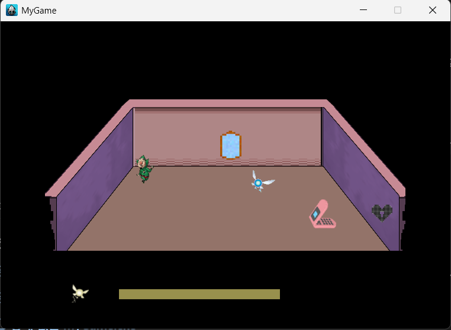
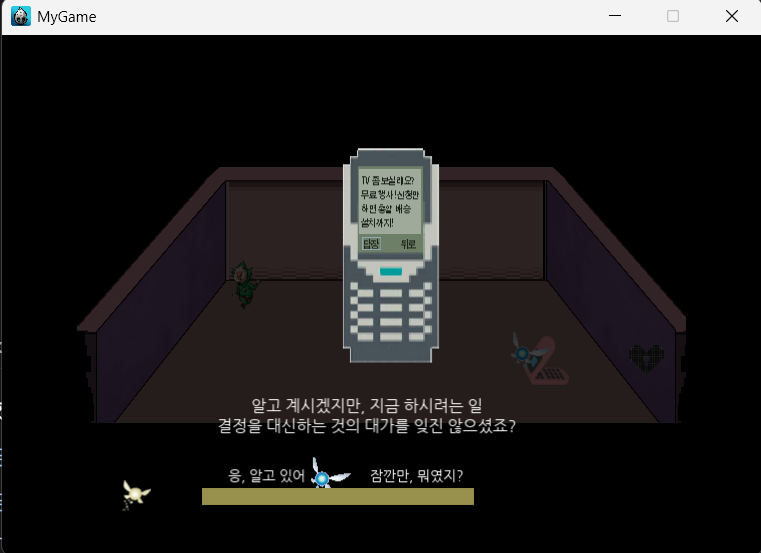

사람의 의식에 개입할 수 있는 정령이 신탁을 수행하기 위해 한 사람의 집을 찾아가는 2D 어드벤처 게임입니다. (미완성)

| 게임 플레이 | 휴대폰 상호작용 |
| :---: | :---: |
|  |  |

## 개발 환경

| 항목 | 내용 |
| --- | --- |
| 엔진 | Cocos2d-x 3.10 |
| 언어 | C++ |
| 대상 플랫폼 | Windows (Win32) |
| 프로젝트 | Visual Studio |

### 빌드 준비

1. [Cocos2d-x 3.10](https://github.com/cocos2d/cocos2d-x/releases/tag/cocos2d-x-3.10)을 내려받습니다.
2. 엔진 폴더에서 `download-deps.py`를 실행합니다.
3. 엔진 폴더 이름을 `cocos2d`로 변경한 뒤 프로젝트 루트에 둡니다.

```text
doubleswamp/
├─ cocos2d/
├─ Classes/
├─ Resources/
└─ proj.win32/
```

## 조작법

| 입력 | 동작 |
| --- | --- |
| 방향키 | 이동 및 메뉴 선택 |
| `Space` | 상호작용 및 선택 |
| `↓` + `Space`를 약 3초간 누르기 | 대상의 의식 안으로 들어가기 |
| `↑` + `Space`를 약 3초간 누르기 | 의식 밖으로 나오기 |
| `Esc` | 휴대폰 화면 등에서 뒤로 가기 |

---

## 게임 오브젝트

### 거울

- 거울 기능을 한다
- 인터랙션하면 캐릭터는 고개를 옆으로 돌리며 보기를 거부한다.

### 탁상

- 휴대폰 혹은 TV가 올려져 있다.

### 문

- 잠금장치가 달려있다.
- 잠금장치는 걸쇠와 돌림쇠로 구성되어 있다
- 특정 조건에서 인터랙션하면 잠금 풀기 모드로 전환된다
  - 조건1 설치맨 도착
  - 조건2 불남

### 이불

- 언제나 펴져 있어 꼬질꼬질하다.
- 특정 조건에서 인터랙션하면 잔다.
- 잠에 들면 다음 씬으로 넘어간다.
  - 조건1 휴대폰 메시지 전송 완료
  - 조건2 TV설치 후 TV와 인터랙션 완료

### 등

- 인터랙션 하면 On/Off 된다
- 밝기가 낮아 켜도 어둑어둑하다

### 벽

- 벽에 붙어서 이동하면 이동속도가 소폭상승한다

### TV

- 어두운 방에다가 빛을.
- 인터랙션 하면 조건에 따라 화면이 재생된다
  - 조건: 설치기사가 왔다 간 뒤 인터랙션
    - 노이즈 화면이 재생되고 있다
  - 조건: 꿈에서 인터랙션
    - 주인공이 계속 누워있고 밤낮이 바뀌는 것이 쪽창으로 보이는 영상이 빠르게 재생되고 있다

### 휴대폰

- 구닥다리 휴대폰이다. 화면과 버튼이 분리되어 있는 폴더구조이다.
- 조건 마다 인터랙션이 다르다
  - 조건1 휴대폰 알람벨이 울린다
    - 문자를 확인한다. 답신하기 선택하면 타자모드로 전환된다
  - 조건2 휴대폰을 떨어트렸다
    - 근처에 가면 발을 헛디뎌서 휴대폰을 박살낸다
  - 조건3 휴대폰이 박살났다
    - ‘으에’ 소리를 낸다. 휴대폰 액정의 빛이 호흡곤란처럼 깜빡인다

### 지팡이

- 인터랙션하면 장착된다.
- 이동속도가 소폭 상승한다.
- 자러가면 자동으로 장착 해제된다.

--- 

## 라이선스

프로젝트에서 사용한 이미지 및 오디오 리소스의 출처

- *LISA: The Painful*
- *Yume Nikki*
- *젤다의 전설* 관련 일러스트
